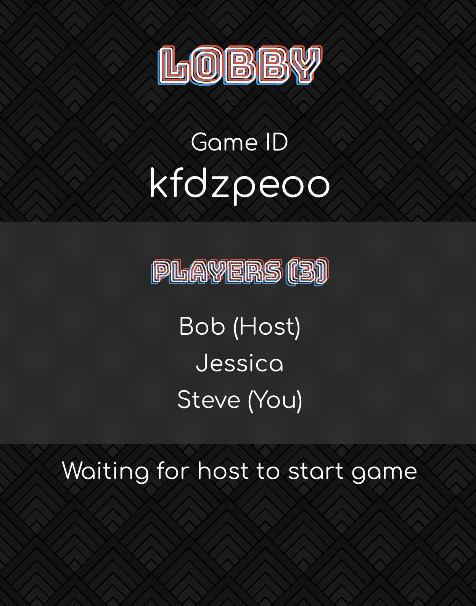

# Party Game

This is a card based party game where one player gets a question and everyone else gets to pick the best answer.
The player with the question can then pick which one is their favorite and that player gets a point.

I made this game to implement react hooks and firebase firestore/realtime database.  
[Check it out!](https://ioan-pop.github.io/Party-Game/)  

Note: This was designed and styled with mobile in mind. Cards data taken from cards against humanity.

## How to use

### As host
Create game  
Share game id with friends  
Start once everyone joined

### As joinee
Join game by game id

### As anyone once game starts
Pick your best card for the question provided  
When it's your turn, pick your favorite answer to award that player a point  
First to point limit wins

## TODOs
Add settings for turns, and turn timers in pre game lobby  
Input validation for names  
Notify everyone of round winner

## Screenshots of game

### Main Menu

### Lobby

### Player View

### Pick View

### Post Game Lobby
